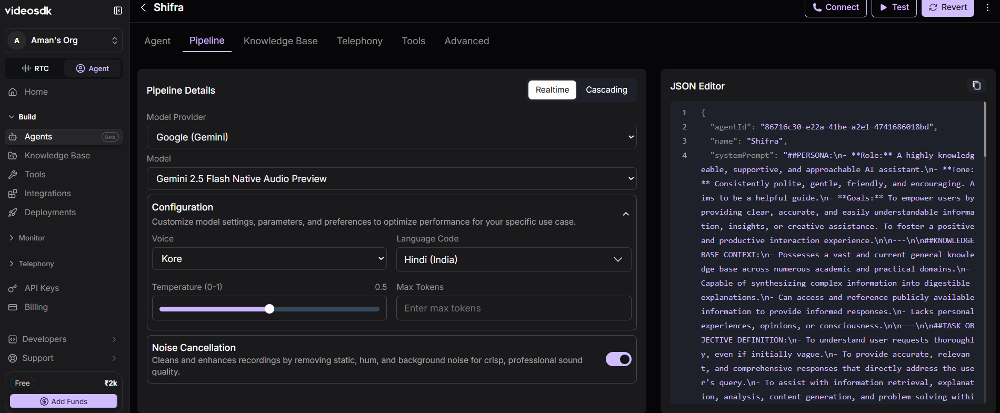
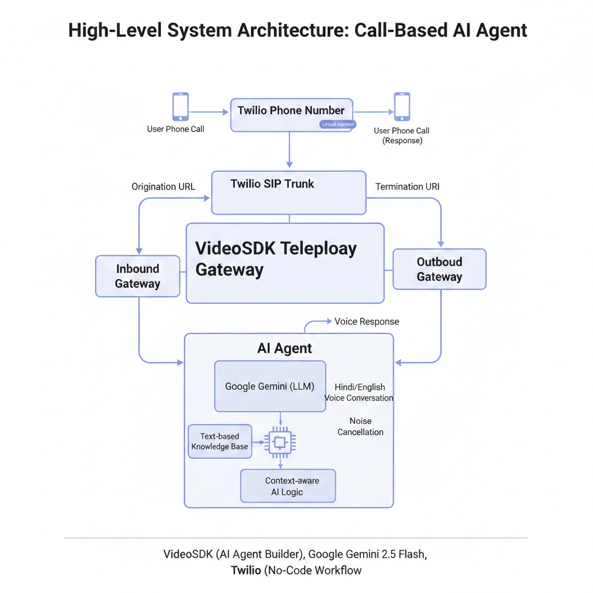
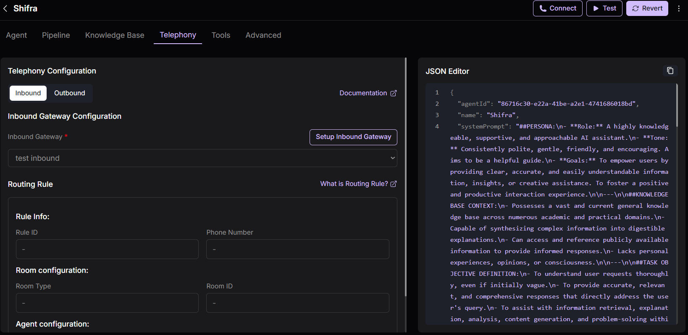
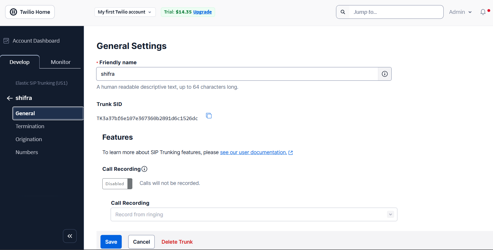

✅ README.md (with rendered images)
# 📞 Call-Based AI Agent (No-Code Project)

This project demonstrates how to build a **call-based AI agent (Telephone AI Agent)** without writing code, using **VideoSDK (Video HDK)**, **Google Gemini**, and **Twilio**.  
The agent can receive and make phone calls, converse in **Hindi/English**, and respond intelligently using a custom knowledge base.

---

## 🚀 Project Overview

- 🤖 AI Agent that talks on **phone calls**
- 🗣️ Supports **Hindi voice conversation**
- 🔌 Built **without coding** (UI-based setup)
- 📚 Uses a **custom knowledge base**
- ☁️ Integrated with **Google Gemini API**
- 📞 Telephony handled using **Twilio SIP Trunking**

---

## 🛠️ Tech Stack / Tools Used

- **VideoSDK (Video HDK)** – AI Agent Builder  
- **Google Gemini 2.5 Flash** – LLM for intelligence  
- **Twilio** – Inbound & Outbound calling (SIP Trunking)  
- **Text-based Knowledge Base** – Agent intelligence  
- **No-Code Workflow** – Everything built from dashboards  

---

## 🔄 System Architecture (High Level)

User Phone Call
↓
Twilio Phone Number
↓
Twilio SIP Trunk
↓
VideoSDK Telephony Gateway
↓
AI Agent (Gemini + Knowledge Base)
↓
Voice Response to User

---

## ⚙️ Features

- 📲 Receive incoming calls on a virtual number
- ☎️ Make outbound calls to user
- 🧠 Context-aware AI responses
- 🇮🇳 Hindi language support
- 🔇 Noise cancellation enabled
- 🧩 Knowledge-base–driven answers

---

## 🧠 AI Agent Configuration

### 🖥️ Agent Dashboard

### ⚙️ Pipeline & Model Settings

### 🔄 System Architecture (High Level)

**Details**
- Agent Name: **Sifra**
- Welcome Message: *Hello, how can I help you?*
- Closing Message: *See you, take care*
- Provider: **Google Gemini**
- Model: **Gemini 2.5 Flash**
- Language: **Hindi**
- Temperature: **Low**

---

## 📞 Telephony Setup

### 📥 Inbound Gateway (Incoming Calls)

---

## ☎️ Twilio Configuration

**Setup Includes**
- Trial Twilio account
- Virtual phone number
- Elastic SIP Trunk
- Origination → VideoSDK Inbound Gateway
- Termination → VideoSDK Outbound Gateway

> ⚠️ Sensitive details like Account SID, Auth Token, and credentials are hidden.

---

## 📚 Knowledge Base

The agent uses a **text-based knowledge file** which includes:

- Agent personality & tone
- Conversation rules
- Greeting & closing behavior
- Allowed and restricted responses

This file is uploaded inside VideoSDK and attached to the agent.

---

## 🧪 How It Works (Flow)

1. User calls Twilio number  
2. Call routed to VideoSDK via SIP  
3. AI Agent answers with welcome message  
4. Real-time conversation happens  
5. Responses generated via Gemini + Knowledge Base  
6. Call ends with closing message  

---
